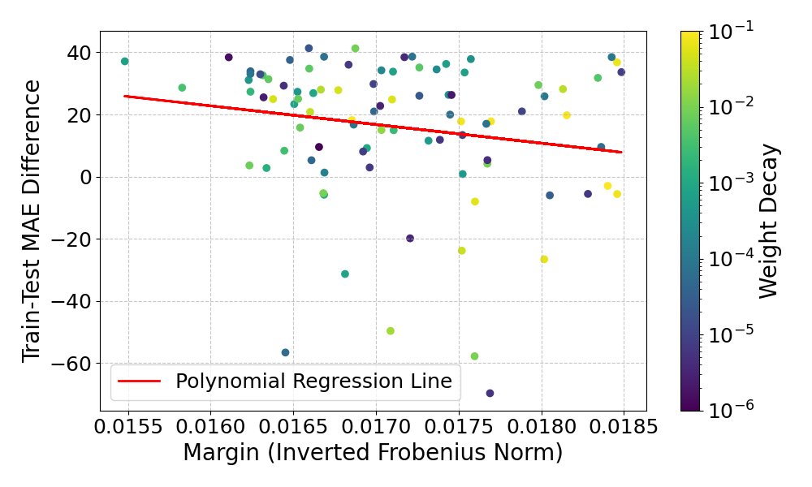

# Experiment

This experiment analyzes the effects of training a graph neural network (GNN) with different weight decays on a
regression task.

The foundation for this experiment is proposition 17 from the paper "A Theory of PAC Learnability of Partial Concept
Classes" (Alon et al., FOCS 2021):

```math
\text{For all } \gamma, R > 0: VC(\mathbb{H}_{R, \gamma}) = \Theta \left( \dfrac{R^2}{\gamma^2} \right) \text{ and } LD(\mathbb{H}_{R, \gamma}) = \Theta \left( \dfrac{R^2}{\gamma^2} \right)
```

Essentially, the proposition states that for all margins $\gamma$, and positive constant $R$, for the linear classifiers
with at least margin $\gamma$, the VC dimension and the LD dimension scale inversely proportional with $\gamma^2$. 

So, this means that if the margin increases the complexity of the class of linear classifiers decreases, which should
lead to better generalization. 

The following figures show the results of training the Graph Neural Network from the “How Powerful are Graph Neural
Networks?” (Xu et al., arXiv preprint arXiv:1810.00826 2018) paper, using the GINConv operator for message passing,
on the QM9 dataset from the "MoleculeNet: a benchmark for molecular machine learning"
(Wu et al., Chemical science 9.2 2018) paper. The dataset consists of about 130000 molecules with 19 regression targets.

The following figure shows the results of training the GNN to predict only the 1. regression target:


In this experiment the margin of the model is represented as the inverted frobenius norm of the model parameters and
generalization is tracked as the difference between train and test MAE, representing the generalization error.
Training the model with different weight decays serves to get different margins since higher weight decay results in
more regularization, specifically smaller weights which lead to a higher margin.

Unfortunately, in this experiment the result doesn't seem to align with the proposition. The polynomial regression line
of dimension 1 suggests that for higher margins, the generalization error rises, but not significantly much.

The next figure shows the results of training the GNN to predict the 2. regression target:


In this case, the resulting regression line aligns with the proposition that higher margins lead to better generalization.
But it needs to be mentioned that this result is most likely influenced by the top left points which could be seen as
outliers since most of the other points are roughly in the same range. If we would omit these "outliers" the result
would look very similar to the result of training the GNN to predict only the 1. regression target.


The last figure shows the results of training the GNN to predict all 19 regression targets:



Here, the regression line indicates that the result seems to align with the proposition. But again, it is noteworthy
that most of the point are roughly in the same range, so the correlation is not fully clear.

