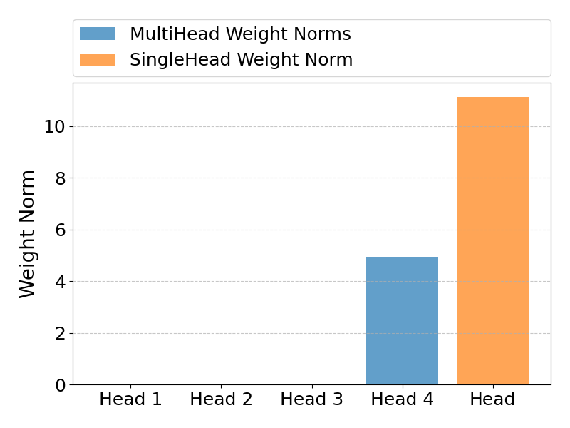

# Experiments

The following experiments extend the experiments from [/weightNorm](/weightNorm/README.md). Here, the impact of 2
regularization versions on the Resnet multi-head model, that uses multiple heads for prediction, are investigated.

## resnet_multihead.py

This experiment tries to apply Multiple Neural Learning (MNL) on the multi-head model. MNL is an interpretable method 
for linear combination of modalities, and proposed in the "Interpretable Tensor Fusion" (Varshneya et al., 
arXiv preprint arXiv:2405.04671 (2024)) paper. The idea is that each head could be seen as a different modality, thus
applying MNL should be possible, resulting in the ability to get relevance scores for each head.

### $p = 1.0, reg_rate = 0.001$

The following figure shows the norm of the weights of the different heads after training with the specified parameters:

The results show that within the multi-head model, Head 4 has the highest norm, and the norms for earlier heads are
decreasing. This suggests that the MNL regularization seems to work on a multi-head model and the different heads can
be seen as different modalities.

The next figure shows the evolution of the relevance scores of each head during training:

We can see that the relevance scores correlate to the head norms. At the beginning, all heads have the same relevance
but during training, the regularization results in an increasing relevance for Head 4 whereas the earlier heads get
lower relevance scores in later epochs, except Head 3 that maintains the same relevance during training.

The next figure compares the performance between single-head model and the regularized multi-head model:

We can see that the single-head model achieves lower loss and higher accuracy. The multi-head model has higher loss
and lower accuracy due to the regularization but it catches up after a sufficient number of epochs. Interestingly,
the validation loss of the single-head model starts to rise after 15 epochs, indicating a possible overfitting. The
multi-head doesn't show such signs, likely because of the regularization.

### $p = 1.0, reg_rate = 0.01$

Compared to the section before, here a higher regularization rate is used.

The figure above shows that after training the multi-head model with a higher regularization rate, only Head 4 has
a norm larger than 0, all other heads have weights with norm 0. This indicates that after this training only Head 4 
plays a role in prediction.

The figure showing the evolution of the relevance scores indicates the same conclusion. We can see that the relevance
scores of Heads 1-3 reach 0 before epoch 30 while Head 4 reaches a relevance scores of 1. Interestingly, the earlier
heads lose their relevance earlier than later heads.

The performance figure shows that for this setting, the multi-head model is much more regularized than before. 
The multi-head validation loss gets smaller much slower and the accuracy also needs longer to rise.

## resnet_multihead_exp_penalty.py

This experiment tries to apply regularization by adding an exponential term to the loss function, depending on the head.
Specifically, further heads that get the output of further layers are penalized more.

### $reg_rate = 0.01$

The figure shows the regularization has an effect: The 1. head has the highest norm while further heads have
exponentially smaller norms, with Head 4 having a norm of 0. This indicates that the first heads now play a more 
important role during prediction.

We also look at the evolution of the norms for each head. The norm of Head 4 drops exponentially to 0, the norm of
Head 3 also drops but not as fast. The norm of Head 2 stays roughly the same, and the norm of Head 1 even rises,
likely due to the other heads losing importance.

The performance graph shows that the multi-head model seems to be regularized too much by this regularization technique.
The multi-head validation loss gets smaller very slowly, possibly not even reaching the level of the single-head model.
Additionally, the multi-head validation accuracy seems to plateau after a few epochs with a big difference to the
single-head model, possibly indicating a potential underfitting.
