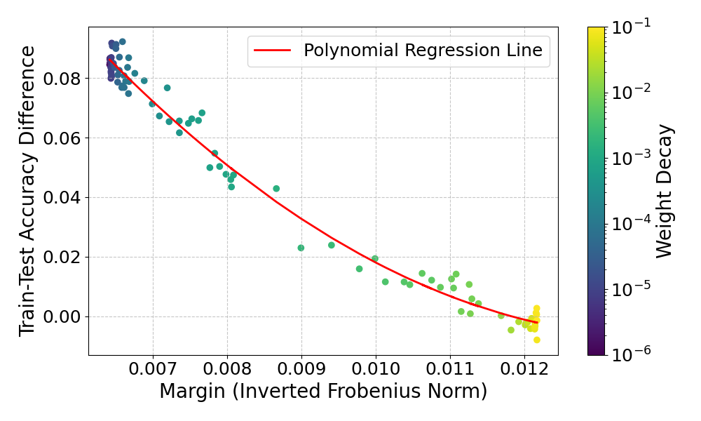

# Experiment

This experiment analyzes the effects of training a language model with different weight decays on a classification task.

The foundation for this experiment is proposition 17 from the paper "A Theory of PAC Learnability of Partial Concept
Classes" (Alon et al., FOCS 2021):

$$\text{For all } \gamma, R > 0: VC(\mathbb{H}_{R, \gamma}) = \Theta \left( \dfrac{R^2}{\gamma^2} \right) \text{ and } LD(\mathbb{H}_{R, \gamma}) = \Theta \left( \dfrac{R^2}{\gamma^2} \right)$$

Essentially, the proposition states that for all margins $\gamma$, and positive constant $R$, for the linear classifiers
with at least margin $\gamma$, the VC dimension and the LD dimension scale inversely proportional with $\gamma^2$. 

So, this means that if the margin increases the complexity of the class of linear classifiers decreases, which should
lead to better generalization. 

The following figure shows the results of training a BERT classifier for sentiment classification on the Imdb dataset.

In this experiment the margin of the model is represented as the inverted frobenius norm of the model parameters and
generalization is tracked as the difference between train and test accuracy, representing the generalization error.
Training the model with different weight decays serves to get different margins since higher weight decay results in
more regularization, specifically smaller weights which lead to a higher margin.

The results seem to align with the proposition. For higher margins, the train-test accuracy difference
(generalization error) gets smaller.

