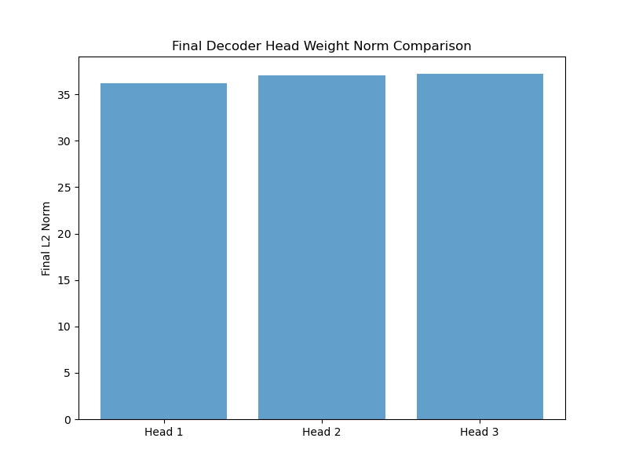
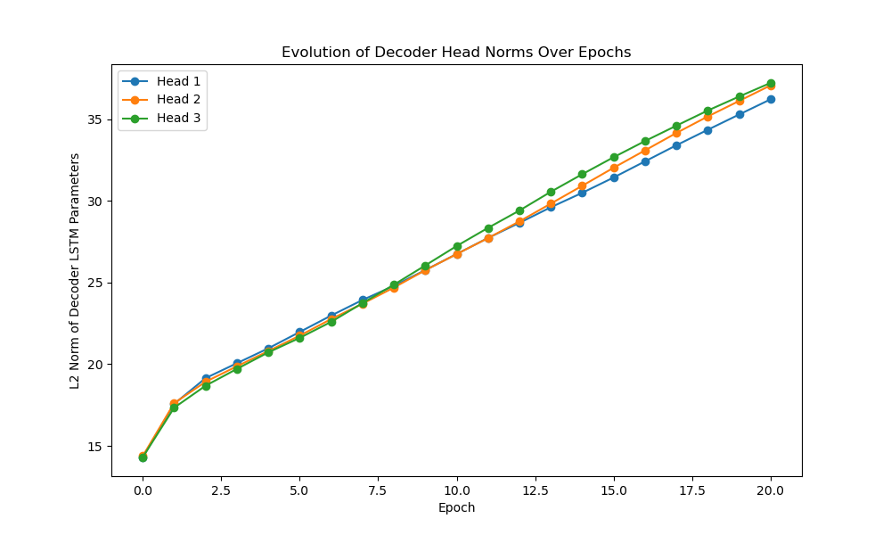

# Experiment

This experiment utilizes the [TimeSeAD](https://github.com/wagner-d/TimeSeAD/tree/master) library to set up and 
evaluate an LSTM-based time-series anomaly detection model on the SMD dataset. 
There are 2 versions of the model: 
- A single-head model that consists of an LSTM-encoder and a single LSTM-decoder head. The decoder has to reconstruct the whole time-series window.
- A multi-head model that consists of an LSTM-encoder and multiple LSTM-decoder representing multiple heads. Each decoder head reconstructs a different part of the whole time-series window.

## Evaluation

Results for single-head model:

|metric                  | test_score | threshold | precision | recall |
|------------------------|------------|-----------|-----------|--------|
|best_ts_f1_score        | 0.4754     | 2082.61   | 0.8088    | 0.3366 |
|ts_auprc                | 0.3789     |           |           |        |
|best_ts_f1_score_classic| 0.3370     | 2328.41   | 0.4459    | 0.2709 |
|ts_auprc_unweighted     | 0.3025     |           |           |        |
|best_f1_score           | 0.6439     | 2460.33   |           |        |
|auprc                   | 0.5582     |           |           |        |

Results for multi-head model:

|metric                  | test_score | threshold | precision | recall  |
|------------------------|------------|-----------|-----------|---------|
|best_ts_f1_score        | 0.4747     | 2125.71   | 0.8049    | 0.3366  |
|ts_auprc                | 0.3549     |           |           |         |
|best_ts_f1_score_classic| 0.3237     | 2042.39   | 0.3913    | 0.2760  |
|ts_auprc_unweighted     | 0.2988     |           |           |         |
|best_f1_score           | 0.6371     | 2583.96   |           |         |
|auprc                   | 0.5471     |           |           |         |

The results show that the multi-head model has a lower score on each metric compared to the single-head model,
but the difference is not significant.
A possible explanation could be that the different decoder heads don't communicate regarding their reconstruction
output, possibly leading to incoherent borders between the different reconstructed windows.

The next figures show the weight norms of the different heads, as well as the evolution of the norms over epochs.

Looking at the norms, the figure indicates the each head has almost the same importance for prediction, but 
that's as expected since each head has to reconstruct a different part of the window, without help from the other
heads.

The evolution of the decoder head norms over epochs shows a similar result. All the heads have roughly the same
importance during training, only in the later epochs, the later heads have a bit higher norm compared to the 1. head
but this difference doesn't seem to be significant.

