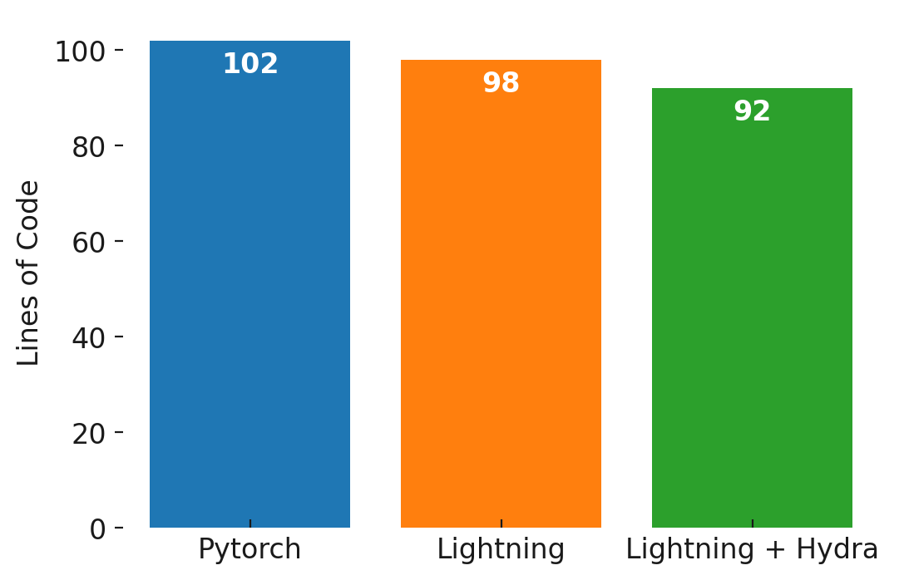

# Experiment

This experiment analyzes how PyTorch Lightning and Hydra can be used to reduce code size.

The experiment setting described in the code is training and testing a simple 2-convolution-layer CNN on the
Mnist dataset. Furthermore, the CNN is trained with a manually set weight decay and the norm of the model
parameters are measured after training.

The different files represent the different stages of the experiment:
- main.py: code using only PyTorch
- main_lightning.py: code using PyTorch Lightning
- main_hydra.py: code using both Lightning & Hydra

The following figure shows the results of this experiment:

Overall, the number of lines of code did decrease, but not by much. 
Essentially with Lightning, you can omit code lines like hardware calls or specifying the training loops, 
but then there are also new extra lines because of the class structure that is enforced by Lightning
or if the hooks provided by Lightning are used. 
I.e. there seems to be a tradeoff for having the flexibility of fully customizing the training process.

With hydra, essentially the argparse lines can be omitted but now a config file is needed. But again, the code
is more structured and separated by having the hyperparameters in a separate file.