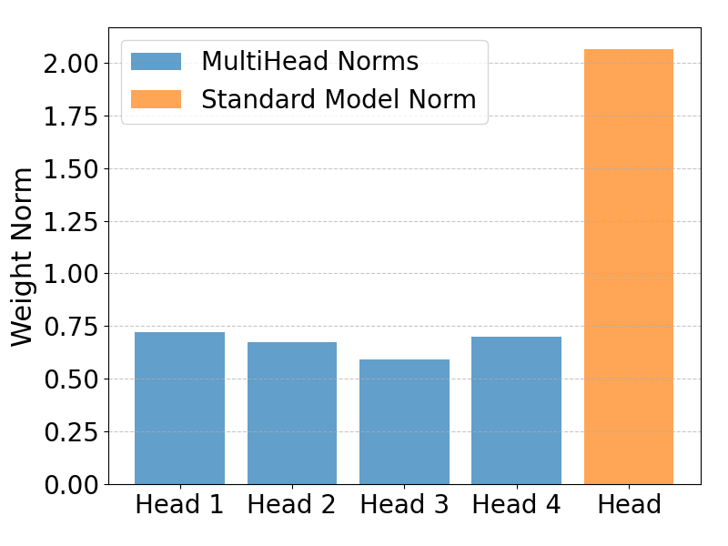
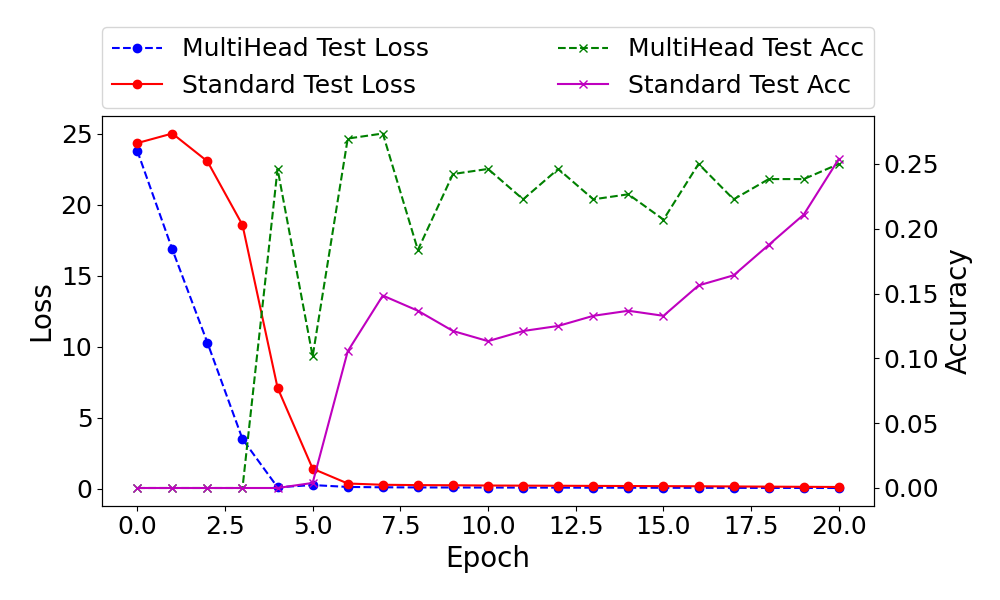
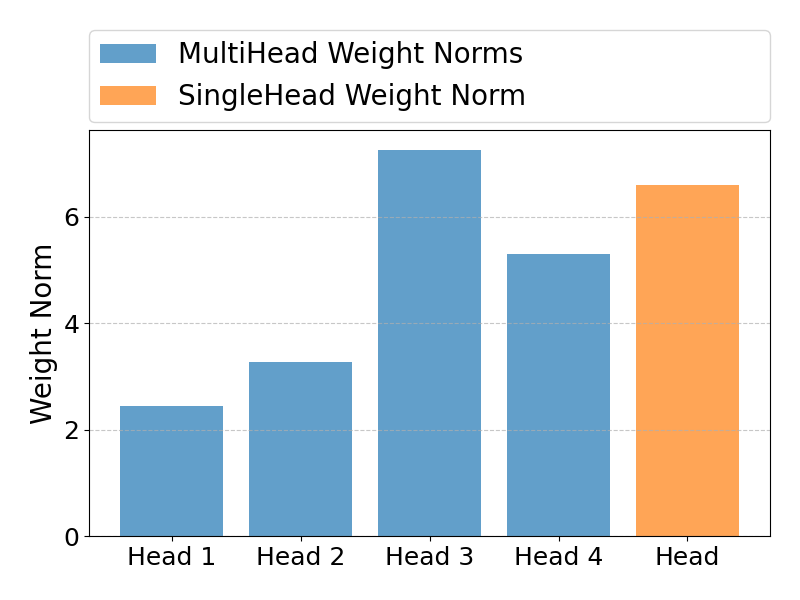
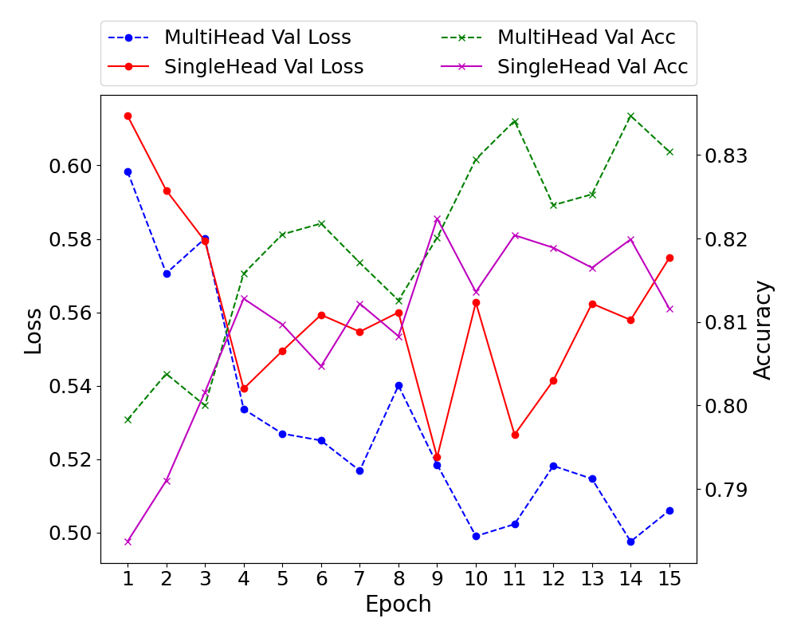

# Experiments

The following experiments try to investigate the question: "Does it make sense to use all/multiple layers of a model
for prediction and not only the last layer?"

To tackle this question, I tried to investigate the norm of the weights for these 2 different scenarios because
they might indicate if one intermediate layer is more important for learning instead of just having the last layer
for prediction.

## multihead_prediction.py

This script trains a simple fully connected neural network on a synthetic regression dataset, while tracking
the performance and the norm of the layer weights after training. One version uses only a single head for prediction,
and another version of the model uses multiple heads for prediction where each head gets the output after a different
layer inside the model. In the multihead version, the outputs of the heads are summed up to get the final prediction.

The following figure shows the norms of the weights of the heads, for the single-head model and the multi-head model:

When using all layers for the prediction, the weight norms are roughly equal, as indicated by the blue bars.
When using only the last layer, the norm is much higher maybe likely due to scaling the layer to have as many
parameters as the other 4 layers combined.

The next figure shows the performance results for the models:

Looking at the performance, there seems to be a difference between the single-head and multi-head model.
First, the loss of the multihead model converges a bit faster. Additionally, the multi-head achieves better accuracy
than the single-head model during the first epochs but the difference gets smaller during the later epochs.

## CNN_multihead_prediction.py

In this experiment, a ResNet model is trained on the CIFAR10 dataset, where the Resnet parameters are frozen and
a fully connected neural network is put on top where the parameters were optimized. The single head model just gets
the final resnet representation as input and in the multihead model each head gets a different intermediate
representation of the resnet as input. In the Resnet18 model, there are 4 stages that consist of blocks, thus each head
gets the feature representation after another stage.

The following figure shows the norms of the weights of the heads, for the single-head model and the multi-head model:

Compared to the synthetic experiment, here the results are a bit different, Head 3 that gets the feature representation
after the 3. stage in Resnet has the highest norm, followed by Head 4 that gets the final feature representation of
Resnet. The first 2 heads have much lower norm which could indicate that the intermediate to late features were more
important for training the model, or the later heads were more dominant during training.

The following figure shows the performance of the 2 models:

The graph shows that the training was a bit unstable. But looking at the validation losses, it seems that the
multi-head model achieves lower loss compared to the single-head model, and regarding the validation accuracies,
the multi-head model also achieves a bit higher accuracy.
The result might indicate that the multi-head version generalizes a bit better than the single-head version.
It could be because the multi-head model might be more effective at extracting diverse features.
